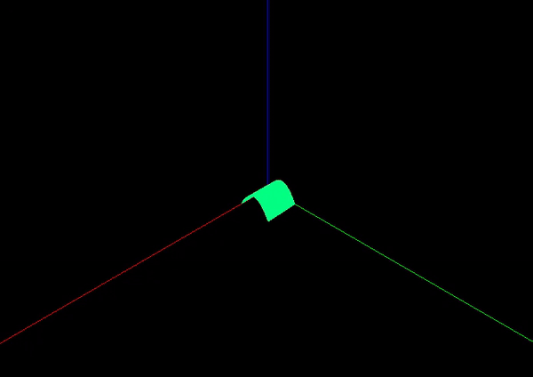

# Projeto 2 CG

### _Projeto em `OpenGL` para fazer Tranformações em uma Superfície de Bezier 3D_

### _Para a disciplina da Universidade: `Computação Gráfica`_

## 📂Tutorial Para Executar

1. Clone o repositório na sua máquina
2. Já está compilado, só executar o `main.exe`

## 👁️Instruções ao Executar

1. Maximize a tela para visualizar a superfície 3D
<<<<<<< HEAD
2. Aperte `"p"` e vc visualizará a malha polígonal 3D
3. Aperte `"Espaço"` continuamente e vc verá as transformações (Com a ordem Translação, Escala, Translação, Rotação, Cisalhamento, Reflexão)
4. Aperte `"Esc"` ou `"Q"` e vc sairá do programa
=======
2. Aperte `"p"` e vc visualizará a malha polígonal 3D 
3. Aperte `"Espaço"` continuamente e vc verá as transformações (Com a ordem Translação, Escala, Translação, Rotação, Cisalhamento e Reflexão)
4. Aperte `"Esc"` ou `"Q"` e vc sairá do programa 
>>>>>>> 6225f0af928c3217666ad942c63a2be15f893f66

## 🤓O que esse código faz?

- **_Visualiza uma Curva de Bézier, só que agora em 3D, produzida por uma nuvem de pontos visualizável_** 📈  
- **_Feito em [C ++](https://cplusplus.com/)_** 👨‍💻  
- **_Usando [GLFW 3](https://www.glfw.org/) + [GLUT](https://www.opengl.org/resources/libraries/glut/)_** 🪟

## 🧐A funcionalidade principal do programa:

- Basicamente uma Renderização Gráfica
- Carrega pontos de controle a partir de um arquivo .obj e calcula a superfície de Bézier 3D;
- Aplica Transformações Geométricas: Translação(t), Escala(s), Rotação(r), Cisalhamento(c), Reflexão(e);
- Cria uma janela interativa onde o usuário pode visualizar a superfície de Bézier e alternar a visualização dos pontos de controle em amarelo.

## 📄Arquivo .obj

|         `"v"`         |        `"t/s/r/c/e"`         |
| :-------------------: | :--------------------------: |
| Vértices do espaço 3D | Tranformações geométricas 3D |
